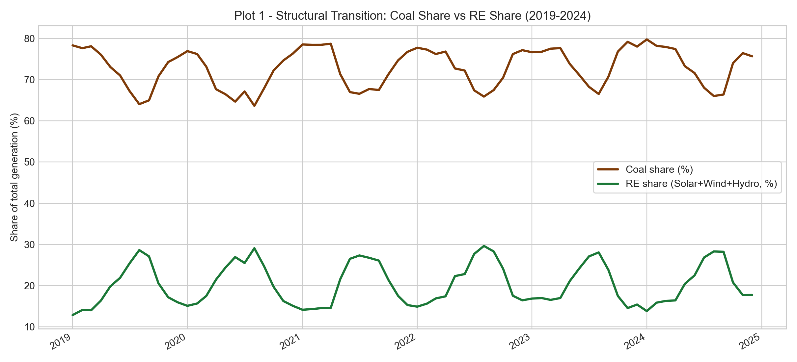
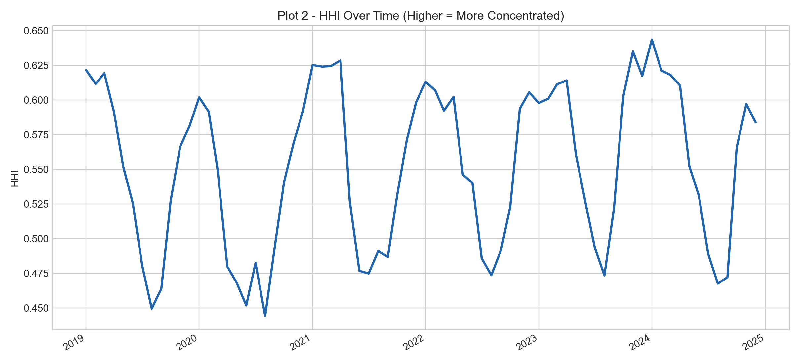
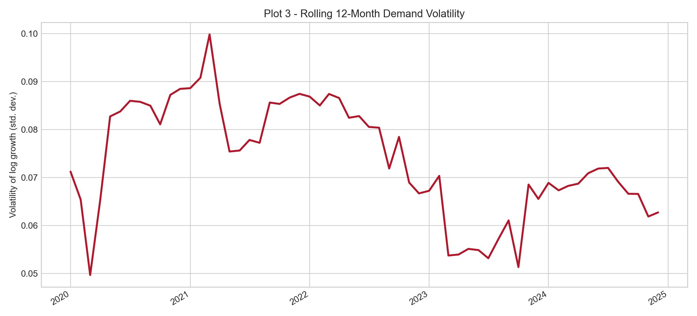
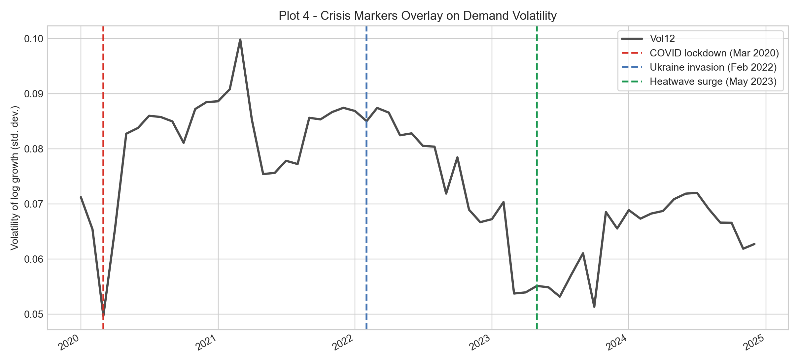
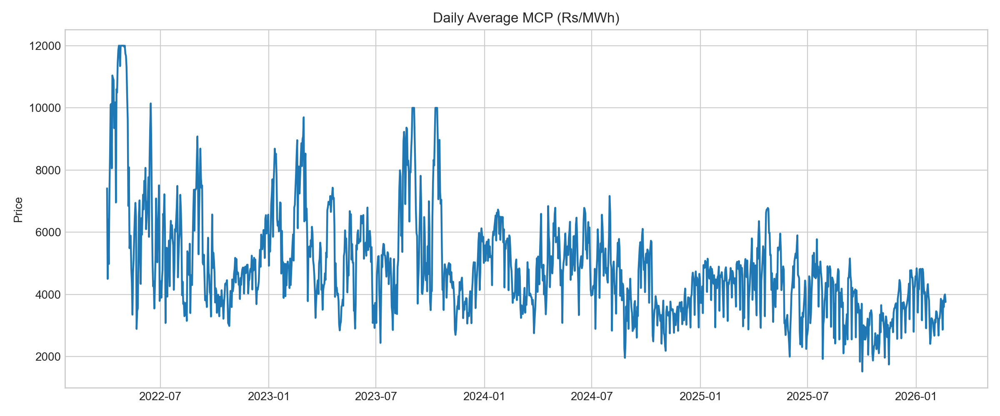
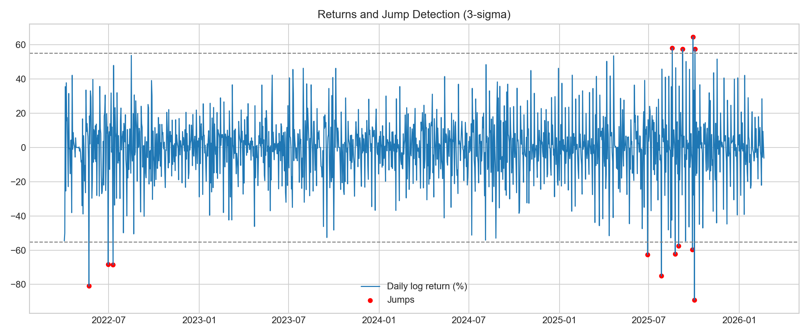
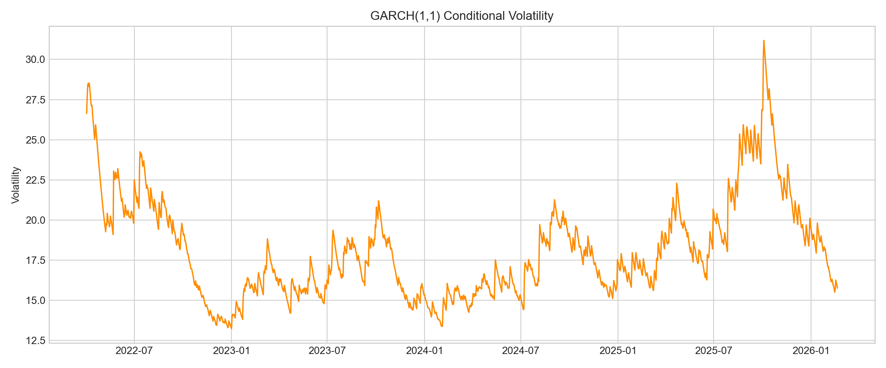
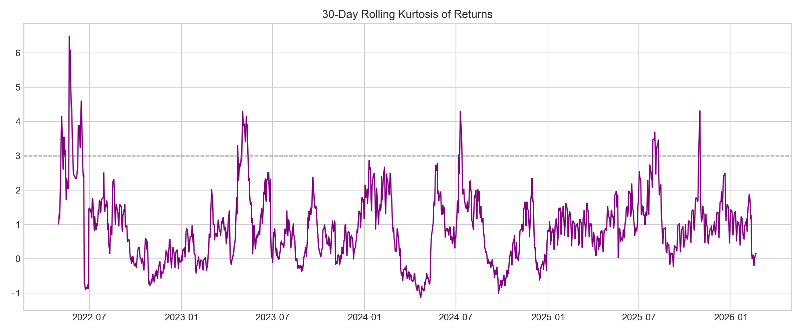
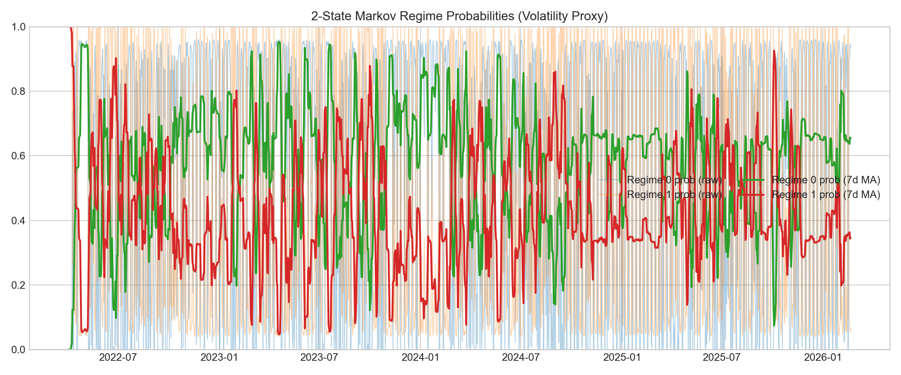

# Stochastic Modelling of Electricity Prices with Jump Diffusion (India - IEX)

A Python project for modeling Indian electricity market prices and analyzing generation-side structural change using IEX market data and ETS-related power datasets.

## Overview

This repository contains two analysis scripts focused on electricity market dynamics in India:

- `ets_generation_analysis.py` builds monthly generation indicators from a long-format electricity dataset.
- `iex_market_modelling.py` processes Indian Energy Exchange DAM market snapshots and fits time-series, volatility, jump, and regime-switching models.

The project is currently structured as a lightweight research repository rather than a packaged Python library.

## Repository Structure

```text
ets-project/
|-- ets_generation_analysis.py
|-- iex_market_modelling.py
|-- requirements.txt
|-- README.md
|-- LICENSE
|-- assets/
|   |-- plots/
|   |   |-- ets/
|   |   |-- iex/
```

## Analysis Modules

### `ets_generation_analysis.py`

This script:

- loads a monthly long-format electricity generation CSV
- filters to `India Total`, `Electricity generation`, and `GWh`
- extracts fuel-level series for coal, gas, solar, wind, and hydro
- constructs total generation using known total labels or a fallback sum across fuels
- creates derived indicators including generation in TWh, fuel shares, renewable share, HHI concentration, log-growth, and 12-month rolling volatility
- fits an econometric model of volatility as a function of HHI and renewable share
- exports plots, a model summary, and a cleaned output dataset

### `iex_market_modelling.py`

This script:

- reads multiple IEX DAM market snapshot Excel files using a filename glob
- detects the correct header row automatically
- validates and cleans the required columns
- aggregates intraday MCP observations into a daily average price series
- builds log-price and return series
- fits an AR(1) model, GARCH(1,1), jump detection, rolling kurtosis, and a 2-state Markov regime-switching model
- exports model summaries, interpretation notes, CSV outputs, and plots

## Installation

Use Python 3.10+ and install dependencies with:

```bash
pip install -r requirements.txt
```

Or install them directly:

```bash
pip install pandas numpy matplotlib statsmodels openpyxl arch
```

## Data Inputs

Both scripts currently use hardcoded local Windows paths and should be updated before reuse on another machine.

### `ets_generation_analysis.py`

- input CSV: `C:\Users\Rohen\Downloads\india_monthly_full_release_long_format.csv`
- output folder: `C:\Users\Rohen\Downloads\ets_output`

### `iex_market_modelling.py`

- input Excel glob: `C:\Users\Rohen\Downloads\DAM_Market Snapshot*.xlsx`
- output folder: `C:\Users\Rohen\Downloads\ets_output_iex_models`

## Usage

Run the scripts from the repository root:

```bash
python ets_generation_analysis.py
python iex_market_modelling.py
```

## Outputs

### Generation analysis outputs

Files written by `ets_generation_analysis.py` include:

- `india_power_core_variables_2019_2024.csv`
- `econometric_model_summary.txt`
- `plot1_structural_transition.png`
- `plot2_hhi_over_time.png`
- `plot3_rolling_demand_volatility.png`
- `plot4_crisis_markers_overlay.png`

### IEX modelling outputs

Files written by `iex_market_modelling.py` include:

- `model_daily_series.csv`
- `model_summary.txt`
- `interpretation.txt`
- `ar1_summary.txt`
- `garch_summary.txt`
- `regime_switching_summary.txt` when regime estimation succeeds
- `regime_probabilities_raw.csv` when regime estimation succeeds
- `regime_probabilities_7dma.csv` when smoothing is available
- `plot1_daily_price.png`
- `plot2_returns_jumps.png`
- `plot3_garch_conditional_vol.png`
- `plot4_rolling_kurtosis.png`
- `plot5_regime_probabilities.png` when regime estimation succeeds

## Visual Results

### ETS Electricity Generation Analysis

#### Structural Transition



#### HHI Over Time



#### Rolling Demand Volatility



#### Crisis Markers Overlay



### IEX Market Modelling Results

#### Daily Average MCP



#### Returns and Jump Detection



#### GARCH Conditional Volatility



#### Rolling Kurtosis



#### Regime Probabilities



## Notes

- The repository is currently script-based and intended for research workflows.
- File paths are hardcoded for a local Windows environment.
- `ets_generation_analysis.py` can fall back to a NumPy-based OLS implementation if `statsmodels` is unavailable.
- `iex_market_modelling.py` expects DAM snapshot files with the required market fields and may skip malformed files.
- Regime-switching estimation is wrapped in a `try/except`, allowing the rest of the pipeline to complete even if that model fails.

## Next Improvements

- replace hardcoded paths with command-line arguments or a config file
- refactor both scripts into reusable modules
- add sample data schemas
- add automated tests for parsing and transformation logic
- add notebooks or reports interpreting the model outputs

## Author

Rohen
